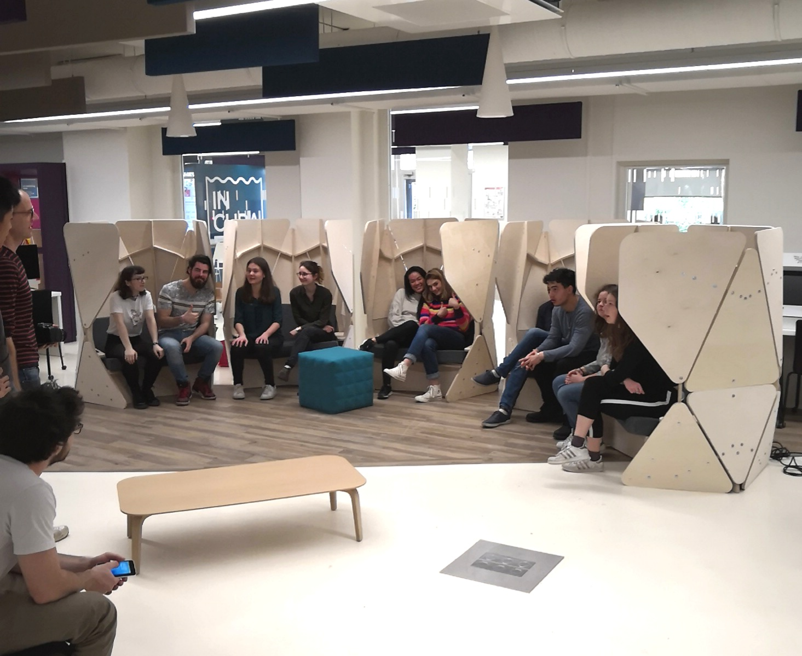
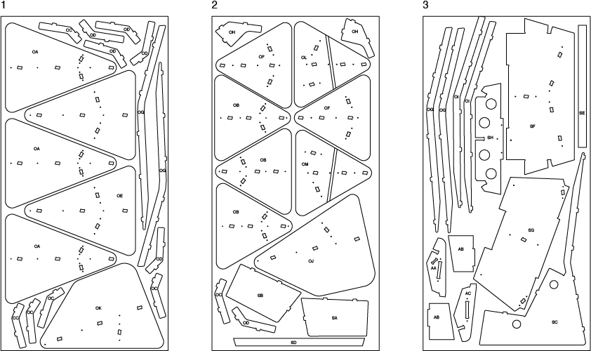

# AIpod Chair

AIpod is an open source chair that was designed and crafted at emlyon Business School’s makers’ lab during a bootcamp about Artificial Intelligence by staff, students and alumni.

IBM Watson NLU was used to analyze the topic, emotions and semantics of academic papers. Then, Google magenta AI composed piano musics based on this analysis. The LCD screen displays the author and title of the interpreted paper.

Seating in the chair you can listen the sound of research, and discover research papers in a new way!

More info here :[makerslab.em-lyon.com](http://makerslab.em-lyon.com/)

AIpod project is licensed under the [CC by-nc-sa 4.0](https://creativecommons.org/licenses/by-nc-sa/4.0/) creative commons license

---

## Building instructions

### Electronics

Instructions for the electronics part used to play the sounds can be found on [this github repository](https://github.com/emlyon/aipod/blob/master/README.md)

---

### CNC milling

AIpod has been designed to be fabricated using a CNC router with plywood 18mm.

Use a 8mm flat milling bit to cut. The [3D model](AIpod_chair.3dm) includes the layout for CNC milling 1250x2500mm plywood panels.

We used [Autodesk Fusion 360](https://www.autodesk.com/products/fusion-360/overview) to generate the toolpaths : you can find tutorials about the _Manufacture_ feature of Fusion 360 on [Autodesk website](https://f360ap.autodesk.com/courses#creating-toolpaths-and-programs-cam).

---

### Assembly

General assembly instructions can be found here : https://hackmd.io/7cDdYA7nRJGSax_ZulLNjg?both

A detailled list of the parts and an assembly guide can be found [in this pdf](AIpod_chair_assembly.pdf).
