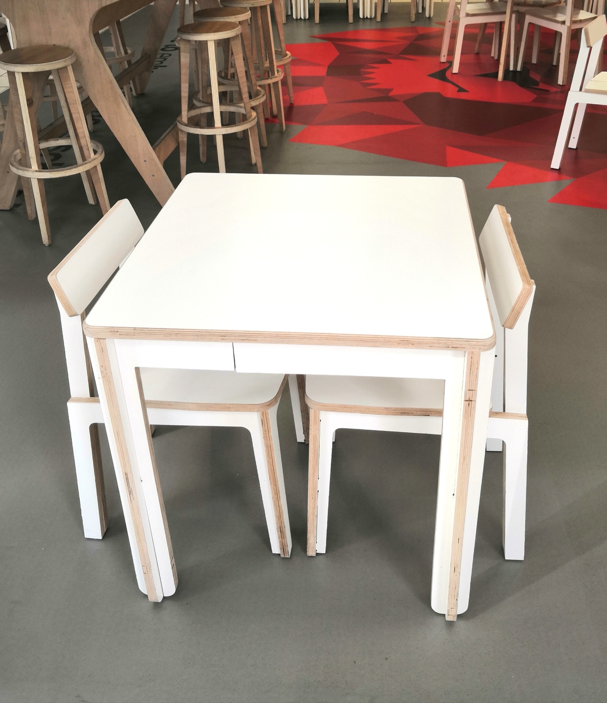

# Minima café table

Minima is a two persons table, based on traditional café table.
It has been designed to be fabricated using a CNC router with plywood 21mm thick.

The 3D file was designed with Rhinoceros 3D.
We used Autodesk Fusion 360 to generate the CNC toolpaths

The design is optimized to reduce use of wood

Use a 8mm flat milling bit to cut.
We included a test sample to help you adjust your CNC toolpath.
